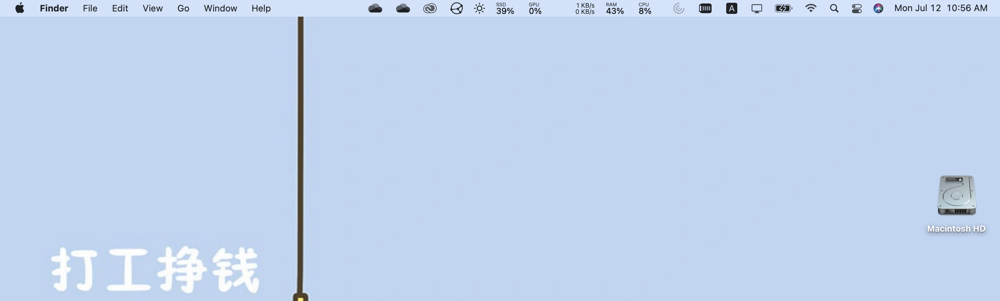

### Introduction
Apple script to customize the wallpaper on based on system time. Simplified implementation based on @[Dynamic_Walls](https://github.com/kush-agra/Dynamic_Walls)
- Big Sur supported
### Features 
- 7:00--20:00(day): wallpaper for work

- 20:00-7:00(night): wallpaper for relax

- Scan every 10 second in the background
### How to use
- Download the zip/clone the repo to your computer
- Open terminal, on the repo folder, run ```sh
sh setup.sh```
- Under ```/Users/$(USER)/Pictures/```, create a folder named ```wallpaper```, and move the images under ```wallpaper```.
Note that you **must edit ```wallpaper.scpt``` to specify your file name**. (You may open wallpaper.scpt with default ```Script Editor```). As defined in ```wallpaper.scpt```, the default image name under `wallpaper` is `IMG001.jpg` and `IMG002.JPG`
### Disable this script
In terminal,
```sh
launchctl unload /Users/$(USER)/Library/LaunchAgents/DynamicWalls.Scheduler.plist

```